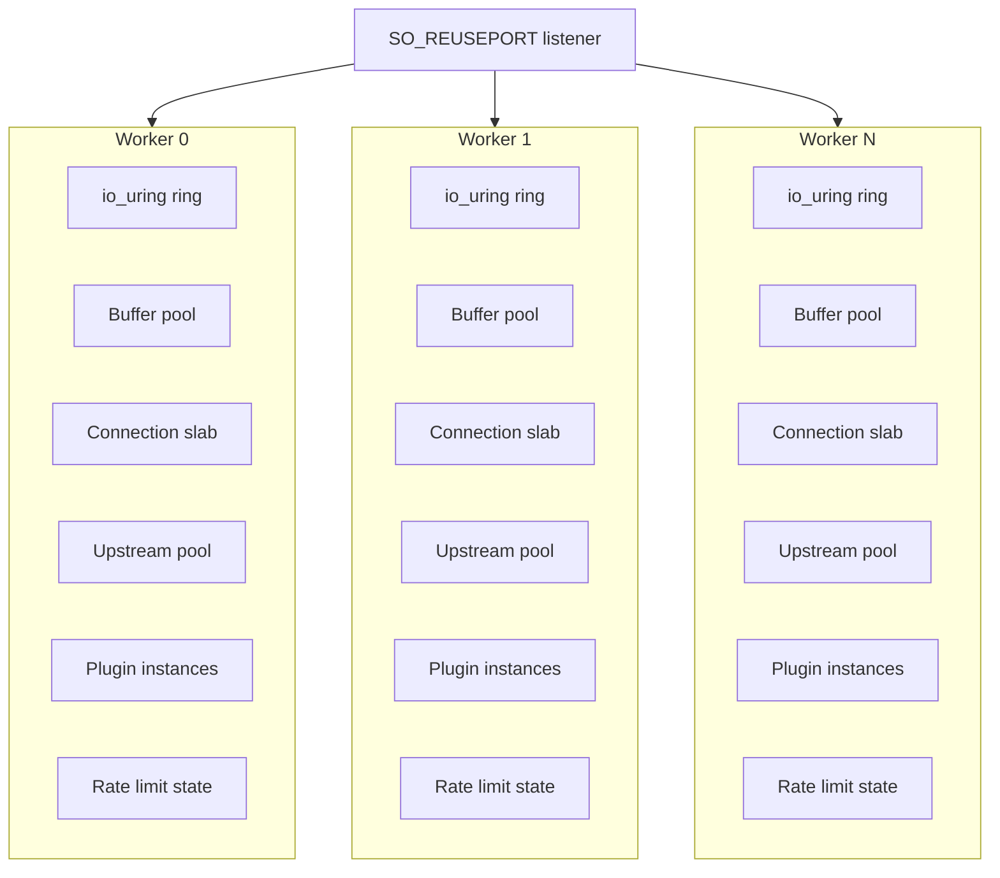
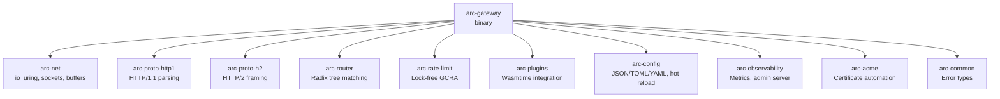

# Architecture

Arc is built around a single principle: the data plane should never block. Every design decision flows from this constraint.

## Why io_uring

Traditional proxy architectures use epoll for I/O multiplexing. While epoll is efficient, it still requires system calls for every I/O operation. At high request rates, these syscalls become a bottleneck.

io_uring changes the model fundamentally. Instead of making syscalls per operation, you submit batches of operations to a ring buffer shared with the kernel. The kernel processes them asynchronously and posts completions to another ring. With SQPOLL enabled, the kernel polls the submission ring continuously, eliminating syscalls entirely from the hot path.

Arc uses several io_uring features:

- **Fixed buffers**: Pre-registered memory regions that the kernel can access without copying. Every read and write uses these buffers.
- **Fixed files**: Pre-registered file descriptors that avoid per-operation fd lookup overhead.
- **Multishot accept**: A single submission that generates multiple completions as connections arrive.
- **Multishot timeout**: Periodic timer completions for housekeeping without repeated submissions.

The result is a data plane that can handle hundreds of thousands of requests per second with minimal CPU overhead.

## Thread-per-Core Model

Arc spawns one worker thread per CPU core. Each worker has completely independent resources:



Each worker binds to its CPU core and opens its own listener socket with `SO_REUSEPORT`. The kernel distributes incoming connections across workers automatically.

This design eliminates cross-thread synchronization in the hot path. Workers never contend for locks during request processing.

## What Workers Share

Only three things are shared across workers:

1. **Configuration** (`ArcSwap<SharedConfig>`): The compiled configuration is wrapped in an atomic swap container. Workers load the current config with a single atomic read. Config updates happen in a background thread that compiles the new config completely before swapping it in.

2. **Metrics** (atomic counters): Each worker has its own metrics struct with `AtomicU64` counters. The admin thread reads these with relaxed ordering to render Prometheus output.

3. **Global rate limit state** (when using distributed limiting): The rate limiter uses atomic CAS operations for its token bucket. Even here, each worker maintains a local cache to minimize contention.

## Module Boundaries

Arc is split into focused crates with strict boundaries:



Each crate has a clear responsibility:

- **arc-net** knows nothing about HTTP. It provides io_uring primitives, buffer management, and socket operations.
- **arc-proto-http1** knows nothing about networking. It parses bytes into HTTP structures and handles chunked encoding.
- **arc-router** knows nothing about requests. It matches byte slices against compiled patterns.
- **arc-rate-limit** knows nothing about routes. It implements a token bucket with atomic operations.
- **arc-plugins** knows nothing about the gateway. It loads WASM modules and manages instance pools.
- **arc-config** handles multi-format parsing (JSON/TOML/YAML), config compilation, error page processing, and hot reload orchestration.

The gateway binary combines these pieces into a state machine that processes connections.

## Connection State Machine

Each connection progresses through phases:


The state machine is explicit. Every connection has a `Phase` enum that determines what I/O operation is pending. When a completion arrives, the worker looks up the connection by its user_data, checks the phase, and transitions to the next state.

Timeouts are tracked per-phase. A background tick (driven by multishot timeout) scans active connections and closes any that have exceeded their phase timeout. This scan is batched and uses cursor-based iteration to avoid O(n) overhead on every tick.

## Hot Reload

Configuration changes are applied without dropping connections:

1. A background thread watches the config file for mtime changes
2. When a change is detected, it reads and parses the file (JSON, TOML, or YAML)
3. For TOML and YAML files, the content is normalized to canonical JSON for internal consistency
4. The new config is compiled: routes are inserted into a radix tree, plugins are loaded, rate limiters are created, error page files are read and fingerprinted
5. Only after successful compilation does `ArcSwap::store` atomically replace the config
6. Workers detect the generation change on their next tick
7. Each worker builds its local resources (plugin instance pools, upstream connection pools) from the new config
8. The worker swaps its active config pointer

During this process, in-flight requests continue using the old config. New requests use the new config. There's no moment where requests are dropped or blocked.

The hot reload fingerprint includes:
- Config file content hash
- Error page file content hashes (for `file` actions)
- TLS certificate file modification times

This ensures that changes to error page templates or certificates trigger a reload even if the main config file hasn't changed.

## Rate Limiting

Arc implements the Generic Cell Rate Algorithm (GCRA), which is mathematically equivalent to a token bucket but requires only a single atomic value.

The algorithm tracks a "theoretical arrival time" (TAT). For each request:

1. Calculate `new_tat = max(current_tat, now) + interval`
2. If `new_tat - now > burst_window`, reject
3. Otherwise, CAS update the TAT and allow

This runs entirely with atomic compare-and-swap. No mutex, no blocking.

For distributed rate limiting, Arc adds a two-tier system:

- **L1 (local)**: Per-worker token bucket for immediate decisions
- **L2 (Redis)**: Global token bucket for cluster-wide limits

Workers never block on Redis. They maintain a local token cache and asynchronously request refills when tokens run low. A circuit breaker trips if Redis becomes slow or unavailable, and workers fall back to L1-only limiting with zero impact on request latency.

## Plugin Isolation

WASM plugins run in Wasmtime with multiple isolation mechanisms:

- **Instance pooling**: Each plugin has a pool of pre-instantiated WASM instances. Requests grab an instance, execute, and return it. No cold-start overhead.
- **Epoch interruption**: Wasmtime's epoch system provides hard timeout guarantees. A background thread increments the epoch every millisecond. Plugins that exceed their timeout are interrupted mid-execution.
- **Panic isolation**: Plugin execution is wrapped in `catch_unwind`. A crashing plugin returns a 500 error without affecting the worker.

The plugin ABI is minimal:

```
memory: exported memory
alloc(len) -> ptr: allocate buffer in WASM memory
dealloc(ptr, len): free buffer
on_request(method_ptr, method_len, path_ptr, path_len) -> status: process request
```

Plugins return 0 to allow the request, or an HTTP status code (100-599) to deny it.

## Why Not Pingora

Arc originally used Cloudflare's Pingora as its data plane. Pingora is excellent software, but it's built on Tokio and epoll. For Arc's goals of maximum throughput with minimum latency, io_uring offered a better foundation.

The migration involved:

- Replacing Pingora's connection handling with a custom io_uring state machine
- Replacing Pingora's HTTP parsing with zero-allocation parsers
- Replacing Pingora's async runtime with a synchronous event loop

The result is a simpler system with fewer abstractions between the application and the kernel.

## Memory Layout

Arc is careful about memory allocation in the hot path:

- **Fixed buffers** are allocated once at startup and registered with io_uring
- **Connection state** lives in a slab allocator with generation counters to prevent ABA problems
- **HTTP parsing** operates on slices into fixed buffers without copying
- **Route matching** uses pre-compiled radix trees with no allocation during lookup
- **Rate limiting** uses stack-allocated state with atomic operations

The only allocations during normal request processing are:

- Upstream connection establishment (pooled and reused)
- Plugin execution (if plugins allocate in WASM memory)
- Metrics counter increments (atomic, no allocation)

## Observability

Every phase transition updates metrics:

- `phase_time_sum_ns`: Cumulative nanoseconds spent in each phase
- `phase_count`: Number of times each phase completed
- `phase_timeouts`: Number of times each phase timed out

These counters let you compute average latency per phase and identify bottlenecks. The admin endpoint renders them in Prometheus format for scraping.

Connection lifecycle metrics track:

- `accepted_total`: Connections accepted
- `active_current`: Currently active connections
- `closed_total`: Connections closed

Ring health metrics catch io_uring problems:

- `ring_sq_dropped`: Submissions dropped due to full ring
- `ring_cq_overflow`: Completions lost due to full ring

If you see non-zero values in ring health metrics, increase `io_uring.entries` in your config.

### Access Log Scope and Context Propagation

Arc access logs are node-local by design. Each node writes to its own local files. Cross-node aggregation is delegated to external log infrastructure.

Trace context behavior follows W3C `traceparent`:

1. If `traceparent` exists and is valid, Arc parses and reuses `trace_id`/`span_id`.
2. If missing or invalid, Arc generates a new `trace_id`/`span_id`.
3. Request context carries these values and logging reads from request context.

For context storage, Arc separates two concerns:

- Request context (`trace_id`, route, upstream): should be task-local or explicit request struct in async runtimes.
- Log ring target: thread-local per worker, because each worker owns its ring buffer.

This separation avoids the common async bug where request context is lost after `await` due to thread migration.

## Error Page Processing

Arc's error page system is designed for flexibility without sacrificing performance:

### Pattern Matching

Error page rules are compiled at config load time into a sorted list. When an error occurs, Arc scans the list in priority order:

1. **Exact codes** (e.g., `502`) - highest priority
2. **Ranges** (e.g., `502-504`) - narrower ranges win over wider ones
3. **Classes** (e.g., `5xx`) - lowest priority

Route-level error pages are checked before global defaults. This allows specific routes to override the default behavior for certain error codes.

### Template Expansion

For `body` and `file` actions, Arc supports template variables that are expanded at runtime:

- `$request_id` - unique request identifier
- `$upstream.name` - name of the upstream that generated the error
- `$error.status` - HTTP status code
- `$error.source` - error source (e.g., "upstream", "timeout")
- `$route.id` - numeric route identifier

Template expansion happens after the error page content is loaded. For `file` actions, the file content is read and cached at config load time, so there's no disk I/O during error handling.

### Upstream Fallback

The `upstream` action allows forwarding error requests to a fallback backend. This is useful for serving dynamic error pages or implementing circuit breaker patterns. To prevent infinite loops, Arc limits error page hops to 1 - if the fallback upstream also returns an error, the original error is returned to the client.

## Configuration Formats

Arc supports three configuration formats:

| Format | Extension | Notes |
|--------|-----------|-------|
| JSON | `.json` | Native format, used as-is |
| TOML | `.toml` | Converted to canonical JSON internally |
| YAML | `.yaml`, `.yml` | Converted to canonical JSON internally |

The control plane API always uses JSON, regardless of the file format. When TOML or YAML configs are loaded, they're normalized to canonical JSON (sorted keys, consistent formatting) for:

- Config fingerprinting (detecting changes)
- Control plane synchronization
- Internal consistency

This normalization ensures that semantically identical configs produce identical fingerprints, even if the original files have different key ordering or whitespace.
