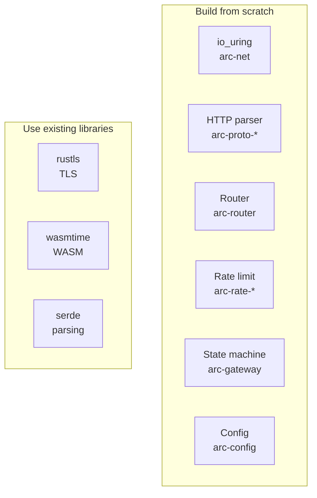

# Components

Arc is built from scratch with minimal external dependencies. This document breaks down what's custom-built vs. what's borrowed.

## Code Statistics

| Crate | Lines | Description | Dependencies |
|-------|-------|-------------|--------------|
| arc-gateway | 13,638 | Main proxy state machine | libc, bytes |
| arc-config | 3,141 | Multi-format config, hot reload | serde, toml, serde_yaml |
| arc-core | 2,184 | Shared types and traits | - |
| arc-net | 1,642 | io_uring, sockets, buffers | libc only |
| arc-router | 1,089 | Radix tree routing | - |
| arc-acme | 1,089 | ACME certificate automation | rustls, ring |
| arc-global-rate-limit | 904 | Distributed rate limiting | redis |
| arc-proto-http1 | 591 | HTTP/1.1 parser | - |
| arc-proto-h2 | 542 | HTTP/2 framing | hpack (codec only) |
| arc-daemon | 447 | Pingora comparison binary | pingora |
| arc-plugins | 347 | WASM plugin runtime | wasmtime |
| arc-observability | 327 | Metrics and admin server | prometheus |
| arc-cli | 126 | CLI interface | clap |
| arc-rate-limit | 104 | GCRA rate limiter | - |
| arc-common | 100 | Error types | - |
| **Total** | **26,271** | | |

## Custom Components (Zero or Minimal Dependencies)

These are the "wheels" we built from scratch:

### io_uring Runtime (`arc-net`) — 1,642 lines

```toml
[dependencies]
libc = "0.2"
```

What we built:
- Raw io_uring syscall wrappers (no liburing)
- Submission/completion queue management
- Fixed buffer registration and management
- Multishot accept and timeout
- SQPOLL configuration
- CPU affinity binding

Why not use existing crates:
- `io-uring` crate adds abstraction overhead
- `tokio-uring` requires async runtime
- We needed direct control over SQE batching and fixed buffers

### HTTP/1.1 Parser (`arc-proto-http1`) — 591 lines

```toml
[dependencies]
# None (only arc-common for error types)
```

What we built:
- Zero-allocation request/response head parsing
- Incremental chunked transfer decoder
- Content-Length/Transfer-Encoding disambiguation
- Keepalive detection

Why not use `httparse`:
- `httparse` allocates for header storage
- We parse directly into fixed buffers
- Tighter integration with our framing logic

### HTTP/2 Framing (`arc-proto-h2`) — 542 lines

```toml
[dependencies]
bytes = "1"
hpack = "0.3"  # Only for HPACK codec
```

What we built:
- Frame header parsing and serialization
- SETTINGS negotiation
- Flow control window tracking
- Stream state machine
- Header block limits (HPACK bomb protection)

Why not use `h2` crate:
- `h2` is async-only (requires tokio)
- We needed synchronous framing for io_uring integration
- `h2` has ~15k lines; we need ~500

### Radix Tree Router (`arc-router`) — 1,089 lines

```toml
[dependencies]
# None (only arc-common)
```

What we built:
- Compressed radix tree for path matching
- Exact, prefix wildcard, named parameter, glob patterns
- Priority-based route selection
- O(log n) lookup with zero allocation

Why not use `matchit` or `path-tree`:
- We needed custom priority semantics
- Integration with our route compilation
- Avoid per-request allocations

### GCRA Rate Limiter (`arc-rate-limit`) — 104 lines

```toml
[dependencies]
# None
```

What we built:
- Generic Cell Rate Algorithm implementation
- Lock-free atomic CAS operations
- No mutex in hot path

Why not use `governor`:
- `governor` has async dependencies
- We needed pure atomic implementation
- 104 lines vs. thousands

### Proxy State Machine (`arc-gateway`) — 13,638 lines

```toml
[dependencies]
libc = "0.2"
bytes = "1"
arc-swap = "1"
# ... internal crates
```

What we built:
- Connection lifecycle management
- Phase-based timeout tracking (timeout wheel)
- Upstream connection pooling with TTL
- Request/response forwarding
- Error page rendering with templates
- H2-to-H1 bridging
- mTLS upstream support

## External Dependencies (Necessary Complexity)

These are battle-tested libraries where reimplementation would be foolish:

### TLS (`rustls`, `tokio-rustls`)

- Memory-safe TLS implementation
- No OpenSSL CVE exposure
- ~50k lines we don't maintain

### WASM Runtime (`wasmtime`)

- Production-grade WASM execution
- Epoch-based interruption
- Instance pooling
- ~500k lines we don't maintain

### Serialization (`serde`, `serde_json`, `toml`, `serde_yaml`)

- Industry standard for Rust serialization
- Multi-format config support
- ~30k lines we don't maintain

### Redis Client (`redis`)

- Distributed rate limiting backend
- Connection pooling
- Lua script support

### Metrics (`prometheus`)

- Standard metrics format
- Scraping compatibility

## Dependency Philosophy



**Rule**: Build custom when it's on the hot path or when existing solutions force architectural compromises (async runtime, allocations, abstraction overhead). Use existing libraries for complex, security-critical subsystems (crypto, WASM sandboxing).

## Lines of Code Breakdown

| Category | Lines | Percentage |
|----------|-------|------------|
| Custom hot-path code | ~18,000 | 69% |
| Config/CLI/Observability | ~3,600 | 14% |
| Pingora comparison (arc-daemon) | ~450 | 2% |
| Integration glue | ~4,200 | 15% |

The core data plane (io_uring + HTTP parsing + routing + rate limiting + state machine) is ~18,000 lines of custom code with minimal dependencies.

## Comparison: Arc vs. Typical Rust Proxy

| Component | Arc | Typical Proxy |
|-----------|-----|---------------|
| Async runtime | None (io_uring) | tokio (~50k lines) |
| HTTP/1.1 | Custom (591 lines) | hyper (~20k lines) |
| HTTP/2 | Custom (542 lines) | h2 (~15k lines) |
| Router | Custom (1,089 lines) | matchit + glue |
| Rate limiter | Custom (104 lines) | governor (~5k lines) |
| I/O layer | Custom io_uring | tokio + mio |

Arc's approach: fewer abstractions, more control, less code in the dependency tree.
